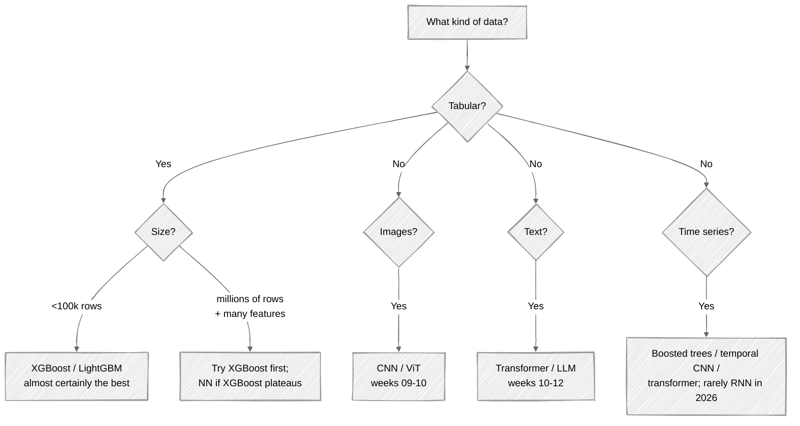

# Week 04: Theory — Classical Machine Learning

Before deep learning ate the world, classical ML was the world. And — here's the uncomfortable truth — most production "ML" in business systems still is. Fraud detection, ad ranking, customer churn, supply forecasting — gradient boosting and logistic regression still dominate. This week earns you the right to talk about deep learning by first understanding the alternatives.

---

## Part 1: The supervised learning setup

You have:

- A dataset `D = {(xᵢ, yᵢ)}` of N input-output pairs
- A model family `f(x; θ)` parameterized by `θ`
- A loss `L(θ)` measuring how badly `f` predicts `y` on the data

You want: `θ* = argmin_θ L(θ)`.

That's it. Every supervised ML algorithm — linear regression, random forests, ResNet-50, GPT — fits this pattern. They differ in the choice of `f`, the choice of `L`, and how they optimize.

---

## Part 2: Train, validation, test — the discipline

You **must** split your data:

| Split | Purpose | When you use it |
|---|---|---|
| **Train** | Fit `θ` | Optimizer reads gradients from it |
| **Validation** | Tune hyperparameters (LR, regularization, model size) | Pick the model variant that wins here |
| **Test** | Final, untouched assessment of generalization | Once. At the end. No iterating against it. |

Typical split: **70/15/15** or **80/10/10**. For very large datasets, you can shrink val and test to fixed sizes (10k each) instead of percentages.

### Why the test set is sacred

Every time you peek at the test set and adjust your model based on it, you're indirectly fitting to it. After 20 iterations of "tweaked LR, retrained, checked test", your "test" score is a function of your tweaks. That's data leakage. **The test set exists to lie to you exactly once, at the end.**

If you absolutely need more iterations against held-out data, do them on the validation set; reserve the test for the final report.

### Stratified splits

For classification with imbalanced classes, random splitting can put all the rare-class examples into train and none into test. Use stratified splits to preserve class proportions:

```python
from sklearn.model_selection import train_test_split
X_train, X_test, y_train, y_test = train_test_split(
    X, y, test_size=0.2, stratify=y, random_state=42
)
```

### k-fold cross-validation

When you don't have enough data to comfortably afford a held-out validation set, use k-fold CV:

- Split train into k folds
- For each fold k: train on the other k-1 folds, validate on fold k
- Report the average across folds

Standard k = 5 or 10. CV gives you a more stable estimate of generalization at the cost of training k times.

---

## Part 3: Linear regression — the canonical model

### The model

```
ŷ = w·x + b   (scalar input, scalar output)
ŷ = w₁x₁ + w₂x₂ + ... + w_d·x_d + b   (vector input)
ŷ = Xw + b   (batch form, X is (N, d) and w is (d,))
```

This is your week 01 `y = Wx + b` with `W` flattened to a vector. **A neural network is N stacked linear regressions with non-linearities between them.**

### The loss (and why)

Mean squared error:

```
L(w, b) = (1/N) Σᵢ (yᵢ - (w·xᵢ + b))²
```

From week 02 theory: MSE is the NLL of a Gaussian noise model. So linear regression = "y is a linear function of x, plus Gaussian noise."

### Solving it: closed-form (the normal equation)

Augment `x` with a 1 to absorb the bias: `x ← [x; 1]`, `w ← [w; b]`. Then `ŷ = Xw`.

Minimize `‖y - Xw‖²`. Take gradient with respect to `w` and set to zero:

```
∇_w ‖y - Xw‖² = -2 Xᵀ(y - Xw) = 0
⟹ XᵀXw = Xᵀy
⟹ w* = (XᵀX)⁻¹ Xᵀy   ← the normal equation
```

In numpy:

```python
w = np.linalg.solve(X.T @ X, X.T @ y)
# Or, more numerically stable:
w, *_ = np.linalg.lstsq(X, y, rcond=None)
```

This works for any number of features. The cost is dominated by `XᵀX`'s inverse — `O(d³)`. For d up to ~10,000 this is fine; beyond that, switch to gradient descent.

### Solving it: gradient descent

```
∇_w L = -(2/N) Xᵀ(y - Xw)
w ← w - α · ∇_w L
```

This is the same iteration you'll use everywhere in deep learning. Just with a different `L`.

### When linear regression isn't enough

- The true relationship isn't linear → use polynomial features (`x, x², x³, ...`), splines, or a deeper model
- The error isn't Gaussian (outliers, heavy tails) → use Huber loss or quantile regression
- Features have different scales → standardize first (`(x - μ) / σ`)
- Many correlated features → use ridge regression (L2 regularized; see Part 6)

---

## Part 4: Logistic regression — classification

### The model

For binary classification (y ∈ {0, 1}):

```
ŷ = σ(w·x + b)   where σ(z) = 1 / (1 + e^(-z))
```

The sigmoid squashes `(-∞, +∞)` into `(0, 1)`, giving you a probability. We then decide class 1 if `ŷ > 0.5`.

### The loss (and why)

Binary cross-entropy:

```
L = -(1/N) Σᵢ [yᵢ log ŷᵢ + (1 - yᵢ) log(1 - ŷᵢ)]
```

From week 02: this is the NLL of a Bernoulli likelihood. `ŷ` is the model's `P(y=1 | x)`; the NLL is `-log` of the predicted probability of the true class.

### Why not MSE for classification?

Two reasons:

1. **MSE doesn't penalize bad probabilities aggressively enough.** A prediction of `ŷ = 0.51` for a true `y = 1` has MSE = 0.24 (small) but log-loss of 0.67 (much larger). Log loss has the right gradient shape for pushing probabilities toward 0 or 1.
2. **MSE under sigmoid has a vanishing-gradient problem.** When `ŷ` is near 0 or 1, the sigmoid's derivative is tiny. Cross-entropy's derivative happens to cancel out the sigmoid's derivative, leaving a clean `(ŷ - y)` term.

This is the same reason every modern classifier uses softmax + cross-entropy together. They're mathematically married.

### Multi-class — softmax regression

For K-class classification:

```
ŷ_k = exp(z_k) / Σ_j exp(z_j)   where z = Wx + b   (z is (K,))
```

`softmax(z)` is a probability distribution over K classes. The loss is **categorical cross-entropy**:

```
L = -(1/N) Σᵢ log ŷ_{i, yᵢ}
```

Equivalently, `-log p(correct class)`. This is what PyTorch's `nn.CrossEntropyLoss` computes — and it fuses softmax + log + NLL for numerical stability (the `LogSumExp` trick).

---

## Part 5: The bias-variance tradeoff

When your model errs, the error has three components:

```
Total error = Bias² + Variance + Irreducible noise
```

- **Bias** — how much the model is *systematically wrong*. Underfitting. A line fit to a curve.
- **Variance** — how much the model's predictions *change with different training samples*. Overfitting. A 100-degree polynomial fits training data perfectly but predicts wildly on new data.
- **Irreducible noise** — inherent randomness in y given x. Even a perfect model can't beat this.

### The U-curve

As you increase model complexity (more parameters, deeper, more features):

- Bias decreases (the model can express more)
- Variance increases (the model overfits more)
- Total error follows a U: drops, then rises

The sweet spot is the bottom of the U. **The whole job of validation sets, regularization, and early stopping is finding it.**

### Modern caveat: double descent

In deep learning, increasing model capacity beyond the "interpolation threshold" (where the model can fit training data perfectly) often *decreases* test error again. This "double descent" phenomenon is why over-parameterized neural networks generalize. We'll see it again in week 11.

---

## Part 6: Regularization — making the model behave

The two universal regularizers:

### L2 regularization (ridge / weight decay)

```
L_reg = L + λ ‖w‖²
```

From week 02 MAP: this is a Gaussian prior on weights. **In deep learning, "weight decay" is L2 regularization, period.**

Geometrically: shrinks weights toward zero, but doesn't force any to be exactly zero. Good when many features matter a little.

### L1 regularization (lasso)

```
L_reg = L + λ Σᵢ |wᵢ|
```

This is a Laplace prior. The `|w|` term has a non-smooth corner at zero, which produces **sparse weights** — many will be exactly zero. Good for feature selection and interpretability.

### Elastic net

A weighted combination of L1 and L2. Use when you want both shrinkage and sparsity.

### Tuning λ

`λ` is a hyperparameter. Sweep it (e.g. logarithmically from 1e-4 to 1e2) and pick the value that maximizes validation performance.

### Other regularizers (preview)

| Regularizer | Where used |
|---|---|
| Dropout | Neural nets (week 08) |
| Early stopping | Everything (week 08) |
| Data augmentation | Vision/NLP (weeks 09-10) |
| Label smoothing | Classification (week 11) |
| Weight noise | Older NN work |

---

## Part 7: Tree-based methods (the truth about tabular data)

For tabular data — rows of structured features — tree-based models typically **beat neural networks**. The state of the art for tabular as of 2026 is still gradient boosting (XGBoost, LightGBM, CatBoost).

### Decision tree (one tree)

Recursively splits the feature space:

```
if x[3] < 0.5:
    if x[7] < 2.0:
        predict A
    else:
        predict B
else:
    if x[1] > 10:
        predict C
    else:
        predict D
```

Each split is chosen to maximize information gain (entropy reduction) or minimize Gini impurity.

A single tree overfits horribly. The fix: an ensemble.

### Random forests

- Train M trees, each on a bootstrap sample (sample with replacement) of the data
- At each split, consider only a random subset of features
- Average their predictions (regression) or majority vote (classification)

This **reduces variance** (each tree overfits in a different direction; averaging cancels it out) without increasing bias much. Easy to use, robust to hyperparameters.

### Gradient boosting

- Train M trees *sequentially*
- Each tree is fit to the **residuals** of the previous trees
- The combined model is the sum of all trees, scaled by a learning rate

Mathematically, this is functional gradient descent in the space of functions: each tree is a step in the direction that reduces the loss.

XGBoost adds second-order info (Newton step instead of gradient), sparsity-aware splits, and a heavy regularization story. It dominates tabular benchmarks for a reason.

### When neural networks win for tabular

- Very large datasets (millions of rows) where deep nets can find higher-order interactions
- Mixed modalities (tabular + text + image) — gradient boosting can't natively fuse
- When you specifically need embeddings learned from your data

For pure tabular under 100k rows: XGBoost first, ask questions later.

---

## Part 8: Evaluation metrics — what "good" means

### Regression

| Metric | When |
|---|---|
| **MSE** | Default; penalizes large errors more |
| **RMSE** | MSE in original units; reportable |
| **MAE** | Robust to outliers |
| **R²** | "Fraction of variance explained" — 1.0 perfect, 0.0 baseline |

### Binary classification

| Metric | When |
|---|---|
| **Accuracy** | Balanced classes; few costs differences |
| **Precision** | False positives are expensive (spam filter) |
| **Recall** | False negatives are expensive (cancer screening) |
| **F1** | Balance precision + recall |
| **ROC-AUC** | Threshold-independent; ranking quality |
| **Precision-Recall AUC** | Imbalanced classes |
| **Log loss / Brier score** | Probability calibration matters |

### Multi-class

- Macro-F1 (average across classes) vs micro-F1 (treat all examples equally) — pick based on whether classes are equally important
- Confusion matrix — read it; do not just report accuracy

### The conversation, not the number

The interview-grade answer to "how do we evaluate this?" is never one number. It's: "I'd report accuracy and confusion matrix because it tells me where the errors are. If class B is critical I'd also report recall for B specifically. I'd also calibrate predicted probabilities and look at the reliability diagram."

---

## Part 9: A decision flowchart for picking a model



---

## Part 10: What to defer

| Topic | When to revisit |
|---|---|
| SVMs | Once useful; now mostly displaced by trees and deep nets |
| k-NN | Nice baseline; not worth deep study |
| Naive Bayes | Cheap baseline; understand the math, skip the deep dive |
| Kernel methods | Theory adjacent; not engineering-critical |
| Bayesian networks | Niche; revisit if probabilistic graphical models become relevant |
| HMMs | Speech / older NLP; mostly displaced |

---

## What's next

In [lab.md](lab.md) you'll:
- Implement linear regression from scratch (numpy) and verify against sklearn
- Implement logistic regression from scratch (numpy) on a 2D dataset
- Plot the loss landscape and watch gradient descent converge
- Use sklearn `Pipeline` correctly on a real Kaggle-style dataset
- Compare logistic regression vs random forest vs XGBoost — see the trade-offs

By week 04's end you should be able to look at a tabular dataset and say, with confidence, which family of model is right for it.
